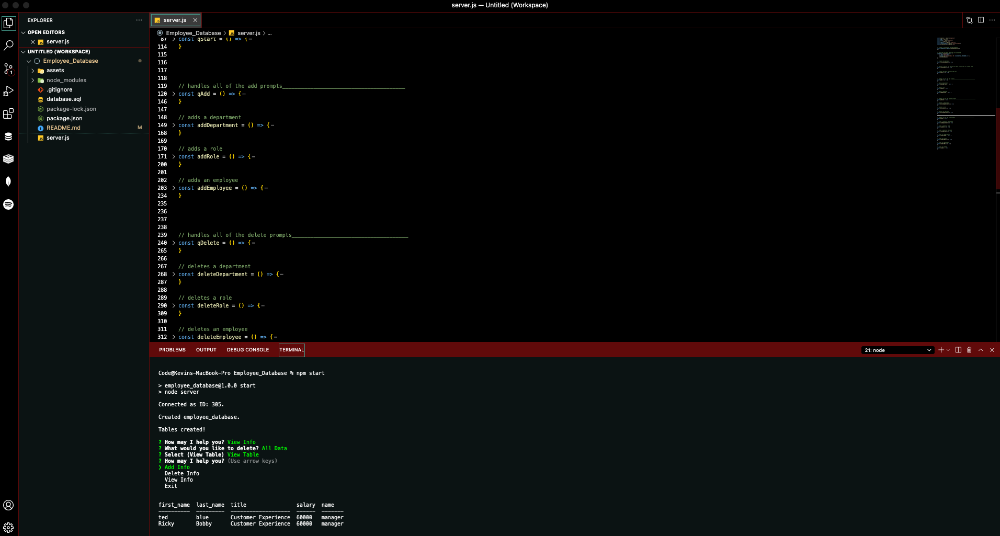

# Employee_Database

 
 

## **Description**
* This uses the NPM Inquirer package and a MySQL database to create a CLI the adds, deletes and views employee information.
 
 

## **Table of Contents**
- [Installation](#Installation)  
- [Usage](#Usage)  
- [License](#License)  
- [Contributing](#Contributing)  
- [Tests](#Tests)  
- [Questions](#Questions)  
- [Screenshot](#Screenshot)  
- [Links](#Links)  
 
 

## **Installation**
* Clone from GitHub
 
 

## **Usage**
* To make adding, deleting and view employee info easier.
 
 

## **License**
### *MIT*  
        A short and simple permissive license with conditions only requiring preservation of copyright and license notices. Licensed works, modifications, and larger works may be distributed under different terms and without source code.
 

## **Contributing**
* No contributions at this time.
 
 

## **Tests**
    
* npm start 
 
 

## **Questions**
* GitHub: https://github.com/KevinHenleyCode

* For more questions you can reach me at my Email:(kevinhenleyinfo@gmail.com)
 
 

## **Screenshot**

 
 

## **Links**
* [Video](https://www.youtube.com/watch?v=F_1HxjfSU74&ab_channel=KevinHenley)
* [Heroku](https://dashboard.heroku.com/apps/whispering-dawn-45033)